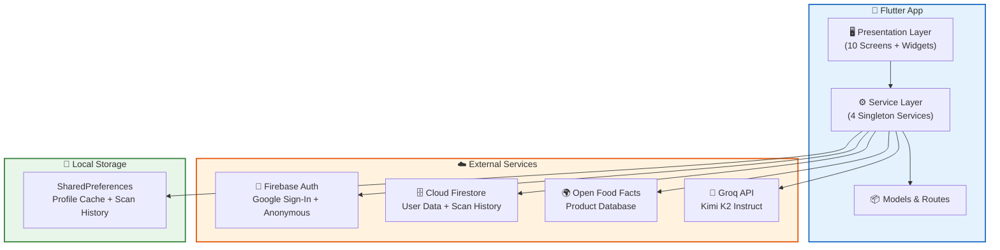
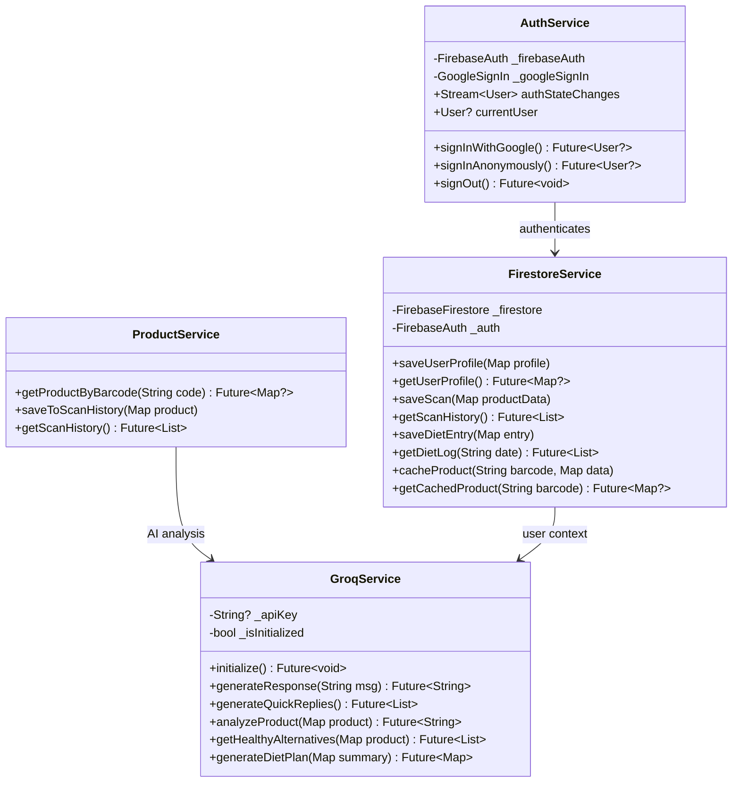
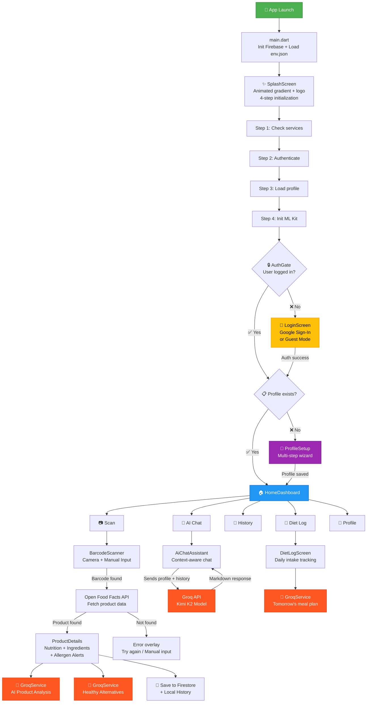
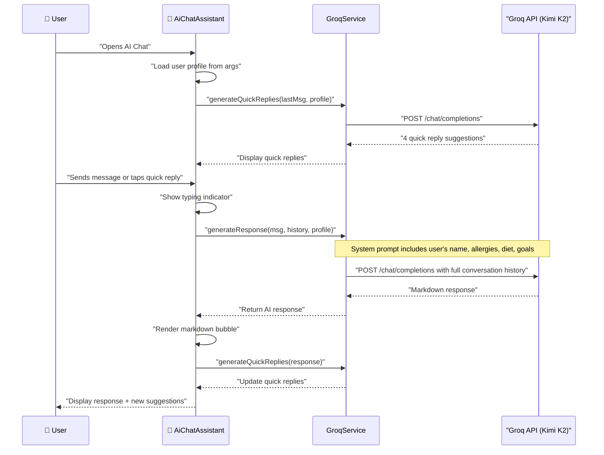
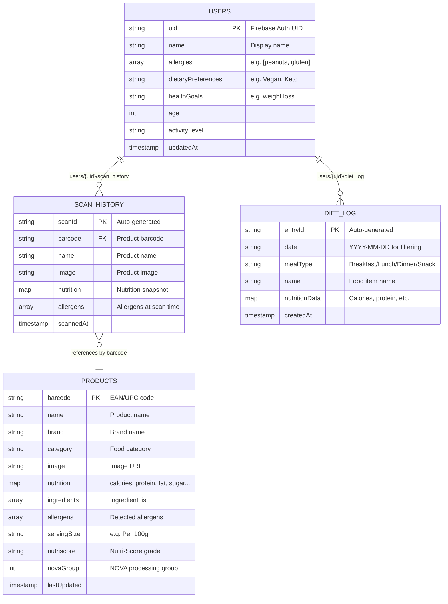

<div align="center">

# 🥗 Food Insight Scanner

### _Scan. Analyze. Eat Smarter._

An AI-powered Flutter application that scans food product barcodes, retrieves real nutritional data from the **Open Food Facts** database, and delivers **personalized health analysis** using **Groq AI** — all tailored to your dietary profile, allergies, and health goals.

<br/>

[](https://flutter.dev)
[](https://dart.dev)
[](https://firebase.google.com)
[](https://groq.com)
[](https://world.openfoodfacts.org/)
[](LICENSE)

<br/>

[Features](#-features) · [Architecture](#-architecture) · [App Flow](#-app-flow) · [Screens](#-screens-in-detail) · [Setup](#-getting-started) · [Contributing](#-contributing)

---

</div>

<br/>

## ✨ Features

<table>
<tr>
<td width="50%">

### 📷 Smart Barcode Scanner
Real-time camera scanning with ML Kit, animated reticle overlay, haptic feedback on detection, flash toggle, and manual barcode entry fallback.

### 🤖 AI Nutrition Assistant
Context-aware conversational chatbot powered by **Groq AI (Kimi K2 model)**. Remembers your allergies, diet preferences, and health goals across the conversation.

### 📊 Product Analysis
Detailed nutrition breakdown with visual progress bars for calories, protein, fat, carbs, sugar, sodium, and fiber. Automatic allergen detection against your profile.

### 🥦 Healthy Alternatives
AI-generated healthier product suggestions with health scores, tailored to your dietary profile and goals.

</td>
<td width="50%">

### 🔐 Secure Authentication
Google Sign-In and Anonymous (guest) mode via Firebase Auth. Seamless session persistence across app restarts.

### 👤 Health Profile Onboarding
Multi-step onboarding wizard to capture allergies, dietary preferences (Vegan, Keto, Halal, etc.), and health goals — all used to personalize every AI interaction.

### 📓 Diet Tracker
Daily food intake logging with AI-generated meal plans for tomorrow based on today's consumption and your nutritional targets.

### ☁️ Cloud Sync
Scan history, diet logs, and user profiles synced to Firestore with per-user security rules. Product data cached globally for faster lookups.

</td>
</tr>
</table>

---

## 🏗️ Architecture

### High-Level System Design



### Tech Stack

<table>
<tr><th>Layer</th><th>Technology</th><th>Purpose</th></tr>
<tr><td>🖥️ <b>Framework</b></td><td>Flutter 3.x / Dart 3.2+</td><td>Cross-platform mobile UI</td></tr>
<tr><td>🧠 <b>AI Engine</b></td><td>Groq API (Kimi K2 Instruct)</td><td>Nutrition chat, product analysis, diet plans, alternatives</td></tr>
<tr><td>🌍 <b>Product Data</b></td><td>Open Food Facts API</td><td>Real nutrition data for millions of products (no key needed)</td></tr>
<tr><td>🔐 <b>Authentication</b></td><td>Firebase Auth</td><td>Google Sign-In + Anonymous guest mode</td></tr>
<tr><td>🗄️ <b>Cloud Database</b></td><td>Cloud Firestore</td><td>User profiles, scan history, diet log, product cache</td></tr>
<tr><td>💾 <b>Local Storage</b></td><td>SharedPreferences</td><td>Profile cache, local scan history, onboarding state</td></tr>
<tr><td>📷 <b>Barcode Scanning</b></td><td>mobile_scanner (ML Kit)</td><td>Real-time camera-based barcode detection</td></tr>
<tr><td>🎨 <b>UI Framework</b></td><td>Material Design 3 + Sizer</td><td>Responsive, premium UI with custom theming</td></tr>
<tr><td>🔄 <b>State Management</b></td><td>Provider + GetIt</td><td>Dependency injection & reactive state</td></tr>
<tr><td>🔤 <b>Typography</b></td><td>Google Fonts</td><td>Premium font rendering</td></tr>
</table>

### Service Layer Architecture

Each service is a **singleton** (factory pattern) ensuring a single instance throughout the app lifecycle:



---

## 🔄 App Flow

### Complete User Journey



### Barcode Scanning Flow

```mermaid
sequenceDiagram
    participant U as 👤 User
    participant BS as 📷 BarcodeScanner
    participant PS as 🔍 ProductService
    participant OFF as 🌍 Open Food Facts
    participant FS as 🗄️ Firestore
    participant GS as 🤖 GroqService
    participant PD as 📊 ProductDetails

    U->>BS: "Opens scanner"
    BS->>BS: "Request camera permission"
    BS->>BS: "Initialize ML Kit"
    
    alt Camera Scan
        U->>BS: "Points camera at barcode"
        BS->>BS: "Barcode detected ✅"
        BS->>BS: "Haptic feedback + Success flash"
    else Manual Input
        U->>BS: "Types barcode manually"
    end
    
    BS->>PS: "getProductByBarcode(code)"
    PS->>OFF: "GET /api/v2/product/{code}.json"
    OFF-->>PS: "Product data (nutrition, ingredients, allergens)"
    PS->>PS: "Parse & normalize data"
    PS->>FS: "cacheProduct(barcode, data)"
    PS->>PS: "saveToScanHistory(product)"
    PS-->>BS: "Return product map"
    
    BS->>PD: "Navigate with product data"
    PD->>GS: "analyzeProduct(product, userProfile)"
    GS-->>PD: "AI health analysis"
    PD->>GS: "getHealthyAlternatives(product)"
    GS-->>PD: "Alternative suggestions"
    PD-->>U: "Display full product view"
```

### AI Chat Flow



---

## 📱 Screens in Detail

<table>
<tr>
<th width="20%">Screen</th>
<th width="40%">Description</th>
<th width="40%">Key Widgets</th>
</tr>

<tr>
<td><b>✨ Splash Screen</b></td>
<td>Animated brand intro with gradient background, elastic logo animation, 4-step loading progress with glassmorphism container, auto-retry on connection failure</td>
<td><code>AnimatedBuilder</code>, <code>LinearGradient</code>, <code>CircularProgressIndicator</code>, <code>AnimatedSwitcher</code></td>
</tr>

<tr>
<td><b>🔑 Login Screen</b></td>
<td>Google Sign-In button with branded styling, anonymous "Continue as Guest" option, Firebase Auth integration</td>
<td><code>GoogleSignIn</code>, <code>FirebaseAuth</code></td>
</tr>

<tr>
<td><b>👤 Profile Setup</b></td>
<td>Multi-step onboarding wizard: <b>Step 1</b> — Allergy selection, <b>Step 2</b> — Dietary preferences, <b>Step 3</b> — Health goal dropdown. Saves to SharedPreferences + Firestore</td>
<td><code>AllergySelectionWidget</code>, <code>DietaryPreferencesWidget</code>, <code>HealthGoalDropdownWidget</code>, <code>ProgressIndicatorWidget</code></td>
</tr>

<tr>
<td><b>🏠 Home Dashboard</b></td>
<td>Main hub with personalized greeting, nutrition summary donut card, quick action buttons (Scan/Chat/History), recent scans with safety indicators (safe/warning/danger), diet log preview</td>
<td><code>GreetingHeader</code>, <code>NutritionSummaryCard</code>, <code>QuickActionsSection</code>, <code>RecentScansSection</code>, <code>DietLogPreview</code></td>
</tr>

<tr>
<td><b>📷 Barcode Scanner</b></td>
<td>Full-screen camera with animated scanning reticle, flash toggle, haptic feedback on detection, success flash animation, manual barcode input fallback, error overlays with retry</td>
<td><code>MobileScanner</code>, <code>CameraOverlayWidget</code>, <code>ScanningAnimationWidget</code>, <code>SuccessFlashWidget</code>, <code>ManualInputWidget</code>, <code>ErrorMessageWidget</code></td>
</tr>

<tr>
<td><b>📊 Product Details</b></td>
<td>Product image with fallback, brand/name/category info, visual nutrition bars, full ingredient list, allergen safety alerts (matched against profile), AI health analysis, healthy alternatives carousel</td>
<td><code>ProductImageWidget</code>, <code>ProductInfoWidget</code>, <code>NutritionBarsWidget</code>, <code>IngredientsWidget</code>, <code>SafetyAlertsWidget</code>, <code>AlternativesWidget</code>, <code>ActionBarWidget</code></td>
</tr>

<tr>
<td><b>🤖 AI Chat</b></td>
<td>Conversational nutrition assistant. Profile-aware system prompt, markdown-rendered responses, typing indicator, dynamic quick-reply suggestions, full conversation history</td>
<td><code>ChatHeaderWidget</code>, <code>ChatInputWidget</code>, <code>MessageBubbleWidget</code>, <code>QuickReplyWidget</code>, <code>TypingIndicatorWidget</code></td>
</tr>

<tr>
<td><b>📜 Scan History</b></td>
<td>Scrollable list of previously scanned products with images, timestamps, and re-scan capability. Synced to Firestore</td>
<td><code>ScanHistoryScreen</code></td>
</tr>

<tr>
<td><b>📓 Diet Log</b></td>
<td>Daily food intake tracker with date-based filtering. AI-generated meal plan for tomorrow based on today's intake</td>
<td><code>DietLogScreen</code></td>
</tr>

<tr>
<td><b>👤 Profile</b></td>
<td>View and edit user profile settings — allergies, dietary preferences, health goals. Sign-out functionality</td>
<td><code>ProfileScreen</code></td>
</tr>
</table>

---

## 🔥 Firestore Data Model



### Firestore Collections

| Collection | Path | Description | Access Rule |
|---|---|---|---|
| **Users** | `users/{userId}` | User profiles with health data | Owner read/write only |
| **Products** | `products/{barcode}` | Cached product data (shared) | Authenticated read/write |
| **Scan History** | `scan_history/{userId}/scans/{scanId}` | Per-user scan records | Owner read/write only |
| **Diet Log** | `diet_log/{userId}/entries/{entryId}` | Per-user daily intake | Owner read/write only |

### Security Rules

```
users/{userId}       → read/write if auth.uid == userId
products/{productId} → read/write if authenticated
scan_history/{uid}/* → read/write if auth.uid == uid
```

---

## 📁 Project Structure

```
food_insight_scanner/
│
├── lib/
│   ├── main.dart                               # 🚀 Entry point — Firebase init, env loading, error handling
│   ├── firebase_options.dart                    # 🔐 Firebase config (⚠️ gitignored — auto-generated)
│   │
│   ├── core/
│   │   ├── app_export.dart                      # 📦 Barrel file — re-exports core utilities
│   │   ├── auth_gate.dart                       # 🔒 StreamBuilder for auth state → Login ↔ Home
│   │   └── services/
│   │       ├── auth_service.dart                # 🔐 Google Sign-In + Anonymous auth
│   │       ├── firestore_service.dart           # 🗄️ CRUD: profiles, scans, diet log, product cache
│   │       ├── groq_service.dart                # 🤖 AI: chat, analysis, alternatives, diet plans
│   │       └── product_service.dart             # 🌍 Open Food Facts API + local scan history
│   │
│   ├── models/
│   │   └── user_profile.dart                    # 📋 UserProfile class with fromMap/toMap
│   │
│   ├── presentation/
│   │   ├── splash_screen/
│   │   │   └── splash_screen.dart               # ✨ Animated splash with 4-step init
│   │   ├── auth/
│   │   │   └── login_screen.dart                # 🔑 Google + Guest login
│   │   ├── profile_setup/
│   │   │   ├── profile_setup.dart               # 👤 Multi-step onboarding wizard
│   │   │   └── widgets/                         # (4 step widgets)
│   │   ├── home_dashboard/
│   │   │   ├── home_dashboard.dart              # 🏠 Main hub with bottom nav
│   │   │   └── widgets/                         # (5 section widgets)
│   │   ├── barcode_scanner/
│   │   │   ├── barcode_scanner.dart             # 📷 Camera scanner + manual input
│   │   │   └── widgets/                         # (5 overlay widgets)
│   │   ├── product_details/
│   │   │   ├── product_details.dart             # 📊 Full product analysis view
│   │   │   └── widgets/                         # (7 detail widgets)
│   │   ├── ai_chat_assistant/
│   │   │   ├── ai_chat_assistant.dart           # 🤖 Conversational AI chat
│   │   │   └── widgets/                         # (5 chat widgets)
│   │   ├── scan_history/
│   │   │   └── scan_history_screen.dart         # 📜 Past scans browser
│   │   ├── diet_log/
│   │   │   └── diet_log_screen.dart             # 📓 Daily intake tracker
│   │   └── profile/
│   │       └── profile_screen.dart              # 👤 Profile view/edit
│   │
│   ├── routes/
│   │   └── app_routes.dart                      # 🗺️ Named routes + onGenerateRoute
│   │
│   ├── theme/
│   │   └── app_theme.dart                       # 🎨 Material 3 light/dark themes
│   │
│   └── widgets/                                 # 🧩 Shared reusable widgets
│       ├── custom_error_widget.dart
│       ├── custom_icon_widget.dart
│       └── custom_image_widget.dart
│
├── assets/
│   ├── env.json                                 # 🔐 API keys (⚠️ gitignored)
│   └── images/
│       ├── img_app_logo.svg                     # App logo
│       ├── no-image.jpg                         # Product image fallback
│       └── sad_face.svg                         # Error state illustration
│
├── android/                                     # 📱 Android platform config
├── ios/                                         # 🍎 iOS platform config
├── firestore.rules                              # 🔒 Firestore security rules
├── firestore.indexes.json                       # 📇 Firestore composite indexes
├── env.json.example                             # 📄 Template for environment variables
├── pubspec.yaml                                 # 📦 Flutter dependencies
├── analysis_options.yaml                        # 🔍 Dart analyzer config
├── LICENSE                                      # ⚖️ MIT License
└── .gitignore                                   # 🚫 Git exclusions
```

> **📊 Stats:** 36 Dart source files • 10 screens • 26 widgets • 4 services • 1 model

---

## 🚀 Getting Started

### Prerequisites

| Requirement | Version | Link |
|---|---|---|
| Flutter SDK | ≥ 3.2.3 | [Install Flutter](https://docs.flutter.dev/get-started/install) |
| Dart SDK | ≥ 3.2.3 | Included with Flutter |
| Android Studio / VS Code | Latest | [Android Studio](https://developer.android.com/studio) |
| Firebase Project | — | [Firebase Console](https://console.firebase.google.com/) |
| Groq API Key | Free | [console.groq.com](https://console.groq.com/) |

### Step 1 → Clone

```bash
git clone https://github.com/aanandmodi/food-insight-scanner.git
cd food-insight-scanner
```

### Step 2 → Configure Environment

```bash
# Copy the template
cp env.json.example env.json
cp env.json.example assets/env.json
```

Edit both `env.json` files with your keys:

```json
{
    "GROQ_API_KEY": "your_groq_api_key_here"
}
```

> 💡 Only `GROQ_API_KEY` is required. Other keys are placeholders for future features.

### Step 3 → Set Up Firebase

```bash
# 1. Install FlutterFire CLI
dart pub global activate flutterfire_cli

# 2. Generate Firebase config (creates lib/firebase_options.dart)
flutterfire configure

# 3. Deploy Firestore security rules
firebase deploy --only firestore:rules
```

Enable in Firebase Console:
- **Authentication** → Sign-in method → ✅ Google, ✅ Anonymous
- **Cloud Firestore** → Create database → Production mode

### Step 4 → Install & Run

```bash
# Get dependencies
flutter pub get

# Run on device / emulator
flutter run
```

### Step 5 → (Optional) Custom App Icon

```bash
flutter pub run flutter_launcher_icons
```

---

## 🔐 Security

| Security Measure | Status | Details |
|---|---|---|
| API keys at runtime | ✅ | Loaded from `assets/env.json` (gitignored) |
| Firebase config | ✅ | `firebase_options.dart` is gitignored |
| Google Services | ✅ | `google-services.json` is gitignored |
| Firestore rules | ✅ | Per-user read/write enforcement |
| Auth required | ✅ | All DB operations require authentication |
| Template provided | ✅ | `env.json.example` for easy onboarding |

---

## 📦 Dependencies

<table>
<tr><th>Package</th><th>Version</th><th>Purpose</th></tr>
<tr><td><code>firebase_core</code></td><td>^3.1.1</td><td>Firebase initialization</td></tr>
<tr><td><code>firebase_auth</code></td><td>^5.1.1</td><td>Authentication (Google + Anonymous)</td></tr>
<tr><td><code>cloud_firestore</code></td><td>^5.0.2</td><td>Cloud database for user data</td></tr>
<tr><td><code>google_sign_in</code></td><td>^6.2.1</td><td>Google OAuth flow</td></tr>
<tr><td><code>mobile_scanner</code></td><td>^5.1.1</td><td>Camera-based barcode/QR scanning</td></tr>
<tr><td><code>http</code></td><td>^1.2.1</td><td>REST API calls (Groq + Open Food Facts)</td></tr>
<tr><td><code>provider</code></td><td>^6.1.2</td><td>State management</td></tr>
<tr><td><code>get_it</code></td><td>^7.7.0</td><td>Service locator / dependency injection</td></tr>
<tr><td><code>shared_preferences</code></td><td>^2.2.3</td><td>Local key-value cache</td></tr>
<tr><td><code>sizer</code></td><td>^2.0.15</td><td>Responsive UI sizing</td></tr>
<tr><td><code>google_fonts</code></td><td>^6.2.1</td><td>Premium Google Fonts typography</td></tr>
<tr><td><code>flutter_markdown</code></td><td>^0.7.1</td><td>Render AI chat responses as Markdown</td></tr>
<tr><td><code>cached_network_image</code></td><td>^3.3.1</td><td>Image caching with placeholders</td></tr>
<tr><td><code>connectivity_plus</code></td><td>^6.0.3</td><td>Network connectivity detection</td></tr>
<tr><td><code>permission_handler</code></td><td>^11.3.1</td><td>Camera & storage permission requests</td></tr>
<tr><td><code>fluttertoast</code></td><td>^9.0.0</td><td>Native toast notifications</td></tr>
<tr><td><code>flutter_svg</code></td><td>^2.0.10+1</td><td>SVG asset rendering</td></tr>
<tr><td><code>intl</code></td><td>^0.20.2</td><td>Date/number internationalization</td></tr>
<tr><td><code>record</code></td><td>^6.0.0</td><td>Audio recording (future feature)</td></tr>
</table>

---

## 🤝 Contributing

Contributions are welcome! Here's how:

1. **Fork** this repository
2. **Create** a feature branch → `git checkout -b feature/my-feature`
3. **Commit** your changes → `git commit -m "Add my feature"`
4. **Push** to the branch → `git push origin feature/my-feature`
5. **Open** a Pull Request

---

## 📄 License

This project is licensed under the **MIT License** — see the [LICENSE](LICENSE) file for details.

---

## 🙏 Acknowledgements

| Resource | Description |
|----------|------------|
| [Open Food Facts](https://world.openfoodfacts.org/) | Free, open-source food product database |
| [Groq](https://groq.com/) | Ultra-fast AI inference platform |
| [Firebase](https://firebase.google.com/) | Authentication, database, and hosting |
| [Flutter](https://flutter.dev/) | Google's cross-platform UI framework |
| [ML Kit](https://developers.google.com/ml-kit) | On-device machine learning for scanning |

---

<div align="center">

**Built with ❤️ using Flutter & AI**

⭐ Star this repo if you find it useful!

</div>
