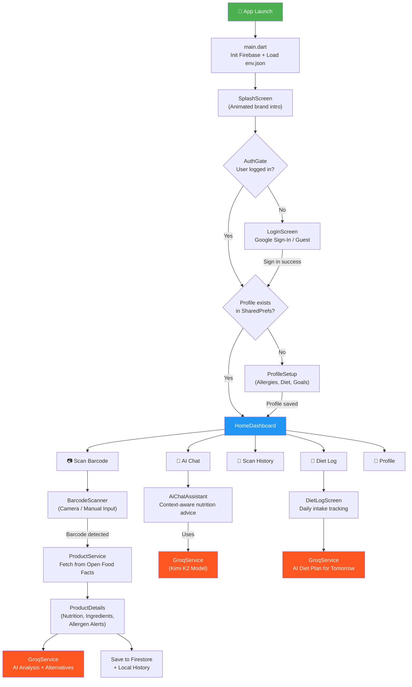
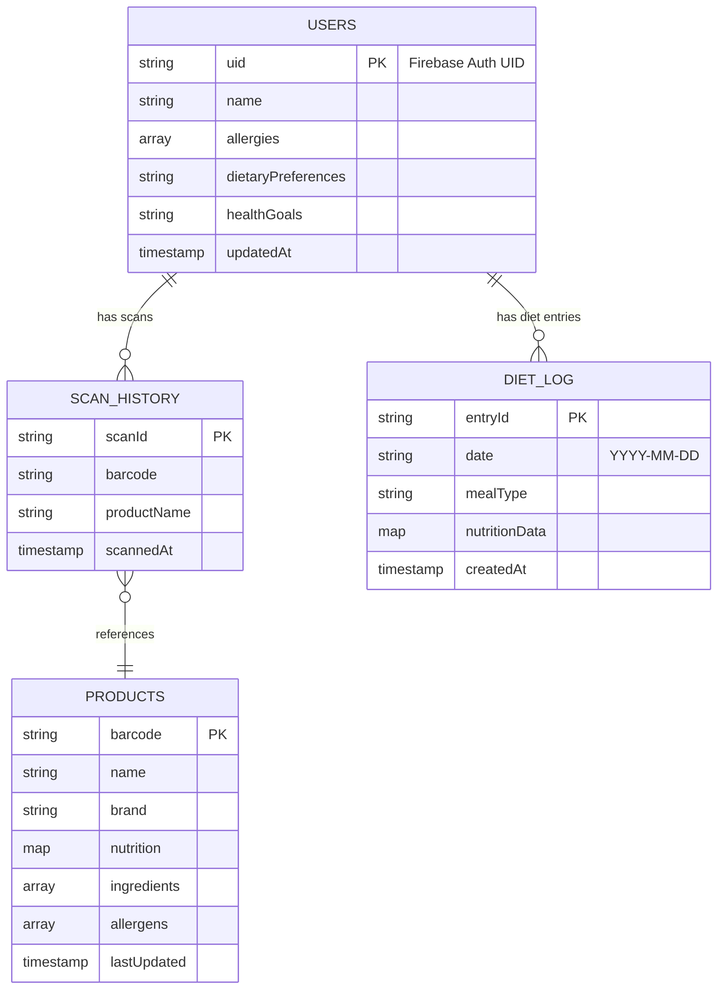

<div align="center">

# 🥗 Food Insight Scanner

### _Scan. Analyze. Eat Smarter._

An AI-powered Flutter application that scans food product barcodes, retrieves detailed nutritional data from the **Open Food Facts** database, and delivers **personalized health analysis** using the **Groq AI** API — all tailored to your dietary profile, allergies, and health goals.

[](https://flutter.dev)
[](https://dart.dev)
[](https://firebase.google.com)
[](https://groq.com)
[](LICENSE)

---

</div>

## ✨ Key Features

| Feature | Description |
|---------|------------|
| 📷 **Barcode Scanner** | Real-time barcode scanning using the device camera with animated overlays |
| 🔍 **Product Lookup** | Instant nutritional data from the [Open Food Facts](https://world.openfoodfacts.org/) database (millions of products) |
| 🤖 **AI Nutrition Chat** | Personalized dietary advice powered by **Groq AI** (Kimi K2 model) |
| 🔐 **Google Sign-In** | Secure authentication via Firebase Auth (Google + Anonymous sign-in) |
| 👤 **Health Profile** | Set allergies, dietary preferences & health goals for tailored analysis |
| 📊 **Nutrition Breakdown** | Visual nutrition bars for calories, protein, fat, carbs, sugar, sodium, fiber |
| ⚠️ **Allergen Alerts** | Automatic allergen detection based on your health profile |
| 🥦 **Healthy Alternatives** | AI-suggested healthier product alternatives |
| 📓 **Diet Log** | Track daily food intake with AI-generated meal plans for tomorrow |
| 📜 **Scan History** | Cloud-synced scan history stored in Firestore |
| 🎨 **Premium UI** | Material Design 3 with custom theme, Google Fonts, and smooth animations |

---

## 🏗️ Architecture & Tech Stack

### Tech Stack

| Layer | Technology |
|-------|-----------|
| **Framework** | Flutter 3.x / Dart 3.2+ |
| **State Management** | Provider + GetIt (Service Locator) |
| **Authentication** | Firebase Auth (Google Sign-In + Anonymous) |
| **Database** | Cloud Firestore (User Profiles, Scan History, Diet Log, Product Cache) |
| **AI Engine** | Groq API — Kimi K2 Instruct model |
| **Product Data** | Open Food Facts API (free, no key required) |
| **Barcode Scanning** | `mobile_scanner` (ML Kit based) |
| **Local Storage** | SharedPreferences |
| **HTTP Client** | Dart `http` package |
| **Responsive UI** | Sizer package |
| **Typography** | Google Fonts |
| **Markdown Rendering** | flutter_markdown |

### Architecture Pattern

The app follows a **feature-first** architecture with clear separation of concerns:

```
┌──────────────────────────────────────────────────┐
│                   Presentation                    │
│   (Screens & Widgets — UI components per feature) │
├──────────────────────────────────────────────────┤
│                   Core Services                   │
│   AuthService │ FirestoreService │ GroqService    │
│              ProductService                       │
├──────────────────────────────────────────────────┤
│                  Data Layer                       │
│   Firebase Auth │ Firestore │ Open Food Facts API │
│          Groq API │ SharedPreferences             │
└──────────────────────────────────────────────────┘
```

---

## 📁 Project Structure

```
food_insight_scanner/
├── lib/
│   ├── main.dart                          # App entry point, Firebase init, env loading
│   ├── firebase_options.dart              # Firebase config (auto-generated, gitignored)
│   │
│   ├── core/
│   │   ├── app_export.dart                # Barrel file — re-exports core utilities
│   │   ├── auth_gate.dart                 # Auth state listener (login ↔ home routing)
│   │   └── services/
│   │       ├── auth_service.dart          # Google Sign-In + Anonymous auth via Firebase
│   │       ├── firestore_service.dart     # Firestore CRUD: profiles, scans, diet log, cache
│   │       ├── groq_service.dart          # Groq AI: chat, product analysis, alternatives, diet plans
│   │       └── product_service.dart       # Open Food Facts API: barcode lookup + local history
│   │
│   ├── models/
│   │   └── user_profile.dart              # UserProfile data class with fromMap/toMap
│   │
│   ├── presentation/
│   │   ├── splash_screen/                 # Animated splash screen
│   │   ├── auth/
│   │   │   └── login_screen.dart          # Google sign-in & guest login UI
│   │   ├── profile_setup/                 # Multi-step onboarding
│   │   │   ├── profile_setup.dart
│   │   │   └── widgets/
│   │   │       ├── allergy_selection_widget.dart
│   │   │       ├── dietary_preferences_widget.dart
│   │   │       ├── health_goal_dropdown_widget.dart
│   │   │       └── progress_indicator_widget.dart
│   │   ├── home_dashboard/                # Main dashboard
│   │   │   ├── home_dashboard.dart
│   │   │   └── widgets/
│   │   │       ├── greeting_header.dart
│   │   │       ├── nutrition_summary_card.dart
│   │   │       ├── quick_actions_section.dart
│   │   │       ├── recent_scans_section.dart
│   │   │       └── diet_log_preview.dart
│   │   ├── barcode_scanner/               # Camera-based scanning
│   │   │   ├── barcode_scanner.dart
│   │   │   └── widgets/
│   │   │       ├── camera_overlay_widget.dart
│   │   │       ├── scanning_animation_widget.dart
│   │   │       ├── manual_input_widget.dart
│   │   │       ├── success_flash_widget.dart
│   │   │       └── error_message_widget.dart
│   │   ├── product_details/               # Full product view
│   │   │   ├── product_details.dart
│   │   │   └── widgets/
│   │   │       ├── product_image_widget.dart
│   │   │       ├── product_info_widget.dart
│   │   │       ├── nutrition_bars_widget.dart
│   │   │       ├── ingredients_widget.dart
│   │   │       ├── safety_alerts_widget.dart
│   │   │       ├── alternatives_widget.dart
│   │   │       └── action_bar_widget.dart
│   │   ├── ai_chat_assistant/             # AI nutrition chatbot
│   │   │   ├── ai_chat_assistant.dart
│   │   │   └── widgets/
│   │   │       ├── chat_header_widget.dart
│   │   │       ├── chat_input_widget.dart
│   │   │       ├── message_bubble_widget.dart
│   │   │       ├── quick_reply_widget.dart
│   │   │       └── typing_indicator_widget.dart
│   │   ├── scan_history/
│   │   │   └── scan_history_screen.dart   # Scrollable history of past scans
│   │   ├── diet_log/
│   │   │   └── diet_log_screen.dart       # Daily food intake tracker
│   │   └── profile/
│   │       └── profile_screen.dart        # View & edit user profile
│   │
│   ├── routes/
│   │   └── app_routes.dart                # Named route definitions & onGenerateRoute
│   │
│   ├── theme/
│   │   └── app_theme.dart                 # Material 3 light/dark theme definitions
│   │
│   └── widgets/                           # Shared reusable widgets
│       ├── custom_error_widget.dart
│       ├── custom_icon_widget.dart
│       └── custom_image_widget.dart
│
├── assets/
│   ├── env.json                           # API keys (gitignored — use env.json.example)
│   └── images/
│       ├── img_app_logo.svg
│       ├── no-image.jpg
│       └── sad_face.svg
│
├── android/                               # Android platform config
├── ios/                                   # iOS platform config
├── firestore.rules                        # Firestore security rules
├── firestore.indexes.json                 # Firestore composite indexes
├── firebase.json                          # Firebase project config
├── env.json.example                       # ✅ Template for environment variables
├── pubspec.yaml                           # Flutter dependencies
├── analysis_options.yaml                  # Dart analyzer rules
└── .gitignore                             # Git exclusions (env, keys, build artifacts)
```

---

## 🔄 App Flow



### User Journey

1. **Launch** → Splash screen with animated branding
2. **Auth Gate** → Checks Firebase Auth state; routes to Login or Home
3. **Login** → Google Sign-In or Anonymous (guest) mode
4. **Profile Setup** → First-time onboarding: name, allergies, dietary preferences, health goals
5. **Home Dashboard** → Greeting header, nutrition summary, quick actions, recent scans preview
6. **Scan Product** → Camera-based barcode scanning (or manual entry) → Fetch from Open Food Facts API
7. **Product Details** → Visual nutrition breakdown, ingredient list, allergen alerts, AI-powered analysis
8. **AI Chat** → Context-aware nutrition assistant that remembers your profile & conversation
9. **Diet Log** → Track daily food intake, get AI-generated meal plans for the next day
10. **Scan History** → Browse previously scanned products (synced to Firestore)

---

## 🔥 Firestore Data Model



**Collections:**
- `users/{userId}` — User profiles (allergies, goals, preferences)
- `products/{barcode}` — Cached product data (shared across all users)
- `scan_history/{userId}/scans/{scanId}` — Per-user scan history
- `diet_log/{userId}/entries/{entryId}` — Per-user daily diet entries

---

## 🚀 Getting Started

### Prerequisites

- **Flutter SDK** ≥ 3.2.3 ([Install Flutter](https://docs.flutter.dev/get-started/install))
- **Dart SDK** ≥ 3.2.3
- **Android Studio** or **VS Code** with Flutter plugin
- **Firebase Project** ([Create one](https://console.firebase.google.com/))
- **Groq API Key** ([Get a free key](https://console.groq.com/))

### 1. Clone the Repository

```bash
git clone https://github.com/aanandmodi/food-insight-scanner.git
cd food-insight-scanner/food_insight_scanner
```

### 2. Set Up Environment Variables

```bash
# Copy the template
cp env.json.example env.json
cp env.json.example assets/env.json
```

Edit `env.json` and `assets/env.json` with your actual API keys:

```json
{
    "GROQ_API_KEY": "gsk_your_actual_groq_key_here"
}
```

> ⚠️ **Important:** Only the `GROQ_API_KEY` is required for core functionality. The other keys are reserved for future features.

### 3. Set Up Firebase

1. Create a Firebase project at [console.firebase.google.com](https://console.firebase.google.com/)
2. Enable **Authentication** → Sign-in method → **Google** and **Anonymous**
3. Enable **Cloud Firestore** database
4. Run FlutterFire CLI to generate Firebase config:

```bash
# Install FlutterFire CLI (if not installed)
dart pub global activate flutterfire_cli

# Configure Firebase for your project
flutterfire configure
```

This generates `lib/firebase_options.dart` with your project-specific Firebase config.

5. Deploy Firestore security rules:

```bash
firebase deploy --only firestore:rules
```

### 4. Install Dependencies & Run

```bash
# Get all packages
flutter pub get

# Run on a connected device / emulator
flutter run
```

### 5. (Optional) Generate App Icons

```bash
flutter pub run flutter_launcher_icons
```

---

## 🔐 Security

This project follows security best practices:

- ✅ **API keys** are loaded at runtime from `assets/env.json` (gitignored)
- ✅ **Firebase config** (`firebase_options.dart`) is gitignored
- ✅ **Firestore rules** enforce per-user read/write access
- ✅ **Authentication required** for all database operations
- ✅ Template file `env.json.example` is provided for onboarding

---

## 📦 Dependencies

| Package | Purpose |
|---------|---------|
| `firebase_core` | Firebase initialization |
| `firebase_auth` | User authentication |
| `cloud_firestore` | Cloud database |
| `google_sign_in` | Google OAuth |
| `mobile_scanner` | Barcode/QR scanning |
| `http` | REST API calls (Groq + Open Food Facts) |
| `provider` | State management |
| `get_it` | Service locator / dependency injection |
| `sizer` | Responsive UI sizing |
| `google_fonts` | Custom typography |
| `flutter_markdown` | Render AI chat responses |
| `cached_network_image` | Image caching with placeholders |
| `shared_preferences` | Local key-value storage |
| `connectivity_plus` | Network state detection |
| `permission_handler` | Camera permissions |
| `fluttertoast` | Toast notifications |
| `flutter_svg` | SVG asset rendering |
| `intl` | Date/number formatting |
| `record` | Audio recording utilities |

---

## 🤝 Contributing

1. **Fork** the repository
2. **Create** your feature branch (`git checkout -b feature/amazing-feature`)
3. **Commit** your changes (`git commit -m 'Add amazing feature'`)
4. **Push** to the branch (`git push origin feature/amazing-feature`)
5. **Open** a Pull Request

---

## 📄 License

This project is licensed under the **MIT License** — see the [LICENSE](LICENSE) file for details.

---

## 🙏 Acknowledgements

- [Open Food Facts](https://world.openfoodfacts.org/) — Free food product database
- [Groq](https://groq.com/) — Ultra-fast AI inference
- [Firebase](https://firebase.google.com/) — Backend-as-a-Service
- [Flutter](https://flutter.dev/) — Cross-platform UI framework

---

<div align="center">

**Built with ❤️ using Flutter & AI**

</div>
