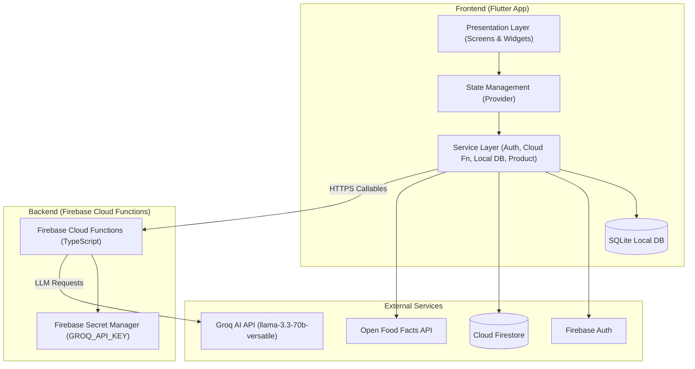
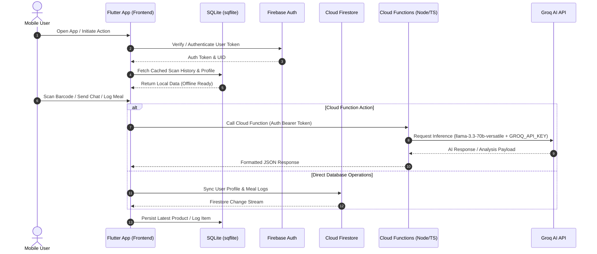
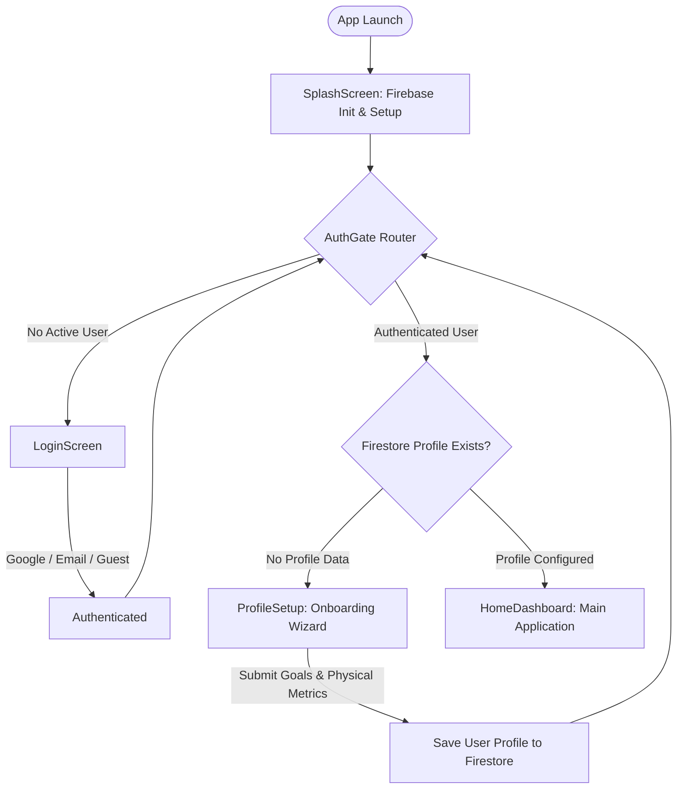

# System Architecture & Design Specification

## 1. High-Level Architecture Overview
The Food Insight Scanner application is built using a monorepo architecture divided into two primary subsystems:
- `frontend/` — Cross-platform mobile application written in Flutter (Dart), targeting Android and iOS. It delivers a rich UI with skeuomorphic design elements, offline persistence, and real-time state management.
- `backend/` — Serverless backend powered by Firebase Cloud Functions (TypeScript). It encapsulates business logic, food analysis pipelines, and integrations with external AI model endpoints.



---

## 2. Frontend Architecture (Flutter)
The mobile application adheres to a clean, layered architecture separating UI presentation, application state, data models, domain logic, and data storage.

### Directory Structure & Module Responsibilities
```
lib/
├── main.dart                    # App entry, Firebase init, Provider setup
├── core/                        # App exports, auth_gate.dart, utilities
│   ├── app_export.dart          # Barrel exports (AppTheme, AppRoutes, widgets)
│   ├── auth_gate.dart           # Auth state router (login vs profile setup vs home)
│   └── utils/
│       ├── connectivity_helper.dart  # Offline network status listener
│       └── user_utils.dart          # TDEE/macro calculators
├── data/
│   └── providers/               # Provider state management
│       └── user_profile_provider.dart # UserProfile state notifier & targets
├── models/                      # Strongly-typed data models
│   ├── diet_entry.dart          # Meal tracking entry model
│   ├── product_model.dart       # Food product analysis & nutrition model
│   ├── scan_history_item.dart   # Scanned barcode history model
│   └── user_profile.dart        # UserProfile data model & health metrics
├── presentation/                # Feature screens
│   ├── splash_screen/           # Animated splash with Firebase init
│   ├── auth/login_screen/       # Google, Email, Guest auth
│   ├── profile_setup/           # Onboarding wizard
│   ├── home_dashboard/          # Main dashboard with 5 widget cards
│   │   └── widgets/             # GreetingHeader, NutritionSummaryCard, etc.
│   ├── barcode_scanner/         # Camera barcode scanning
│   ├── product_details/         # Product analysis display
│   ├── ai_chat_assistant/       # AI chat interface
│   ├── diet_log/                # Daily meal tracking
│   ├── scan_history/            # Previous scans list
│   ├── profile/                 # User profile view
│   ├── settings/                # App settings, sign out, delete account
│   └── shopping_list/           # Grocery list
├── routes/
│   └── app_routes.dart          # Named route definitions
├── services/                    # Business logic / data layer
│   ├── auth_service.dart        # Firebase Auth wrapper
│   ├── cloud_function_service.dart  # Cloud Functions HTTP caller
│   ├── firestore_service.dart   # Firestore CRUD operations
│   ├── local_database_service.dart  # SQLite offline storage
│   └── product_service.dart     # Open Food Facts API + scan history
├── theme/
│   ├── app_theme.dart           # ThemeData configuration
│   └── app_design_system.dart   # Design tokens (colors, typography, shadows, radii)
└── widgets/                     # Shared reusable widgets
    ├── custom_image_widget.dart
    ├── custom_icon_widget.dart
    ├── glow_button.dart
    └── skeuomorphic/skeu_card.dart
```

---

## 3. Backend Architecture (Cloud Functions)
The backend microservices layer is implemented as Firebase Cloud Functions in Node.js / TypeScript (`backend/src/`).

### Cloud Functions Directory & Endpoints
```
backend/src/
├── index.ts              # Exports all 7 callable functions
├── chatWithAI.ts         # AI chat with conversation context, auto meal-logging
├── analyzeProduct.ts     # Deep ingredient analysis, safety scoring
├── scanProduct.ts        # Barcode-based product lookup + AI analysis
├── parseMeal.ts          # Natural language → structured nutrition data
├── generateDietPlan.ts   # AI-generated personalized meal plans
├── generateQuickReplies.ts  # Dynamic chat quick-reply suggestions
└── getAlternatives.ts    # Healthier product alternatives
```

### Configuration & AI Service Integration
- **Secret Protection**: API keys are securely retrieved via Firebase `defineSecret('GROQ_API_KEY')` to avoid exposing credentials in source code.
- **LLM Infrastructure**: Powered by the Groq API utilizing the `llama-3.3-70b-versatile` model for low-latency food analysis and nutritional reasoning.

---

## 4. Data Flow Architecture
The following sequence diagram outlines how data flows between the Flutter frontend, local storage, Firebase services, Cloud Functions, and the external Groq AI API.



---

## 5. Auth Flow & Routing Logic
Authentication state routing is centrally managed by `AuthGate`, evaluating user authentication status and profile completeness on startup or state transitions.



---

## 6. State Management Architecture
State management is implemented using the **Provider** pattern to manage reactive state clean of UI boilerplate:

- **`UserProfileProvider`**:
  - Encapsulates user profile metrics, health goals, and calculated targets (TDEE, daily macros).
  - Listens for changes and updates UI sub-trees reactively.
  - Interacts with `FirestoreService` and `LocalDatabaseService` for bidirectional synchronization.

---

## 7. Offline Resilience Strategy
The application prioritizes offline availability and resilience against network fluctuations:

1. **Local SQLite Persistence (`sqflite`)**:
   - Stores scan history, cached product details, and meal logs locally on the device.
   - Allows users to view previous scans and product information without an active internet connection.

2. **Network Timeout & Graceful Degradation**:
   - Network interactions with Firebase Cloud Functions and external APIs implement strict timeouts.
   - When offline or during server downtime, the app falls back to cached SQLite entries and notifies the user gracefully.
   - Network status changes are continuously monitored by `ConnectivityHelper`.
