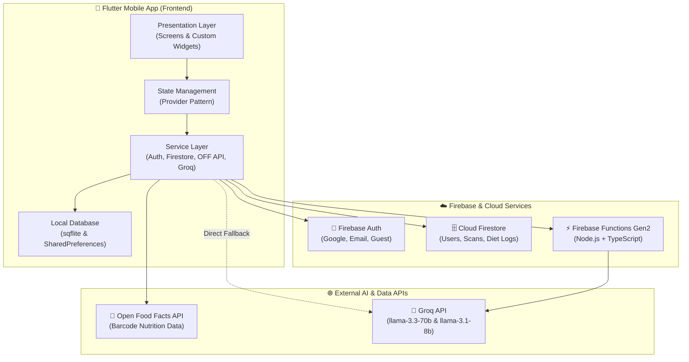
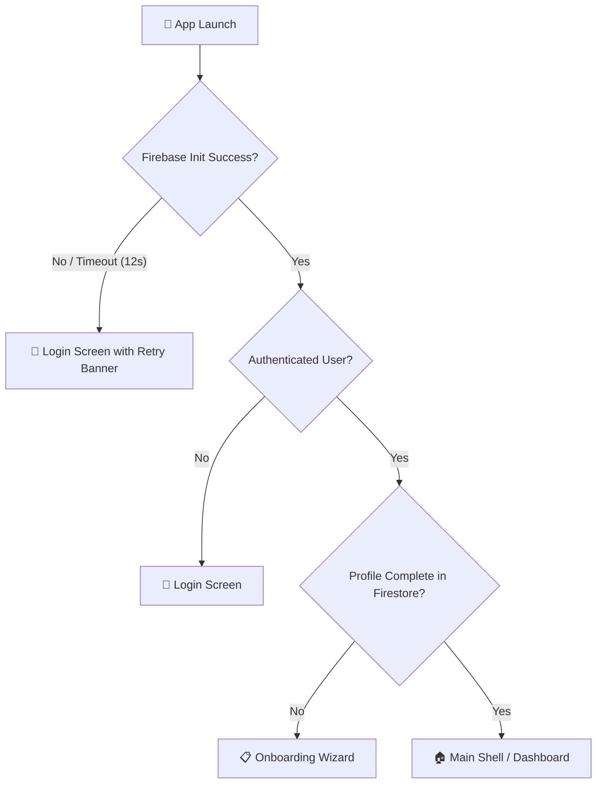

# 🥗 NutriScan AI - Food Insight Scanner | Developer Context & Onboarding Guide

Welcome to the **NutriScan AI** developer documentation. This document serves as a comprehensive onboarding guide and architectural reference for new and existing developers working on the repository.

---

## 📌 Project Context

**NutriScan AI** (Food Insight Scanner) is an AI-powered Flutter & Firebase application designed to help users make healthier dietary choices. Users can scan food product barcodes using their mobile camera, instant-fetch verified product data from the **Open Food Facts** database, receive personalized AI health analysis tailored to their dietary restrictions (allergies, diets, health goals), and interact with a context-aware AI assistant powered by **Groq AI**.

### Core Metadata
- **App Name:** NutriScan AI - Food Insight Scanner
- **Android Package Name:** `com.food_insight_scanner.app`
- **Firebase Project ID:** `food-insight-scanner-app`
- **GitHub Repository:** [https://github.com/aanandmodi/food-insight-scanner](https://github.com/aanandmodi/food-insight-scanner)

### High-Level System Architecture



---

## 💻 Development Environment

Ensure your local development environment satisfies the following platform requirements before building:

| Component | Specification / Version | Notes |
| :--- | :--- | :--- |
| **Flutter SDK** | `3.x` | Target Dart SDK range: `>=3.2.3 <4.0.0` |
| **Android SDK** | `compileSdk 36`<br/>`minSdk 23`<br/>`targetSdk 36` | Java/JVM compatibility set to 1.8; desugaring enabled |
| **Backend Runtime** | Node.js (v18+) with TypeScript | Built using Firebase Functions Gen2 (`firebase-functions ^4.7.0`) |
| **AI Engine** | Groq API | Primary models: `llama-3.3-70b-versatile`, `llama-3.1-8b-instant` |

---

## 📦 Key Dependencies (Frontend)

The Flutter frontend leverages a modular architecture powered by the following core libraries:

```
frontend/pubspec.yaml
```

### 1. Firebase & Authentication
- `firebase_core`: Core SDK for Firebase setup and app initialization.
- `firebase_auth`: User authentication, session management, and credential handling.
- `cloud_firestore`: Realtime document store for user profiles, scan logs, and daily diet logs.
- `cloud_functions`: Direct HTTPS Callable invocation for Firebase Cloud Functions.
- `google_sign_in`: Native Google OAuth single sign-on integration.

### 2. Barcode Scanning & Hardware Access
- `mobile_scanner`: High-performance camera-based barcode scanning powered by native ML Kit.
- `image_picker`: Camera/gallery selection for custom food photo scans and avatar uploads.
- `permission_handler`: Runtime permissions manager for Camera and Storage access.

### 3. State Management & Architecture
- `provider`: Reactive state management (`ChangeNotifierProvider`, `Consumer`) across screen trees.
- `get_it`: Service locator for injecting singleton services (`AuthService`, `DatabaseService`, etc.).

### 4. UI Rendering, Data Visualization & Animations
- `flutter_animate`: Declarative chaining of UI transitions, fade effects, and micro-interactions.
- `sizer`: Dynamic responsive sizing for uniform layouts across diverse screen resolutions.
- `fl_chart`: Animated graphs and charts for daily calorie, macro, and micro-nutrient tracking.
- `flutter_markdown`: Formatted rendering of rich AI nutritional responses and advice.
- `cached_network_image`: Smooth image caching for product photos and user avatars.

### 5. Local Storage & Offline Support
- `sqflite`: SQLite database for offline product caching, local scan history, and draft logs.
- `shared_preferences`: Lightweight persistent storage for user preferences and session flags.

---

## 🔑 Key Configuration Files

The project relies on specific configuration files. Note that sensitive credential files are excluded from version control.

| File Path | Description | Git Status |
| :--- | :--- | :--- |
| `frontend/android/app/google-services.json` | Android Firebase configuration containing API keys & project IDs | 🛑 Ignored (`.gitignore`) |
| `frontend/lib/firebase_options.dart` | Auto-generated FlutterFire credentials for multi-platform init | 🛑 Ignored (`.gitignore`) |
| `frontend/firebase.json` | Root Firebase config for functions deploy and emulator suites | 📝 Tracked |
| `backend/package.json` | Node.js backend dependencies, build scripts, and engine specifications | 📝 Tracked |
| `firestore.rules` | Security rules enforcing user data isolation and product database access | 📝 Tracked |
| `firestore.indexes.json` | Composite index declarations (e.g., collection group queries on `diet_log`) | 📝 Tracked |

### Security Rules Overview (`firestore.rules`)
- **`users/{userId}`**: Read/Write restricted to `request.auth.uid == userId`.
- **`products/{productId}`**: Read/Write accessible to any authenticated user (client-side product cache).
- **`scan_history/{userId}/scans/{scanId}`**: Read/Write restricted to the owner (`request.auth.uid == userId`).
- **`diet_log/{userId}/entries/{entryId}`**: Read/Write restricted to the owner (`request.auth.uid == userId`).
- **`shopping_list/{userId}/items/{itemId}`**: Read/Write restricted to the owner (`request.auth.uid == userId`).

---

## 🎯 Important Design Decisions

### 1. Warm Light Visual Design System
> [!NOTE]
> Even though `ThemeMode.dark` may be set in `main.dart`, the design system forces a custom **Warm Light Theme** (`warmWhite #FAF8F4`).

- **Rationale:** The app overrides default Material dark components to maintain a clean, vibrant aesthetic suited for food and health scanning. The custom palette highlights natural food tones, allergy badges, and clear nutritional scores.

### 2. Startup Resilience & Firebase Init Timeout Guard
> [!IMPORTANT]
> Firebase initialization is wrapped in a **12-second timeout guard**.

- **Rationale:** Mobile network latency or blocked connections during boot can stall `Firebase.initializeApp()`. If initialization exceeds 12 seconds or encounters an error, the app gracefully falls back to render the login UI shell and provides an interactive retry mechanism directly on the login screen.

### 3. Cloud Functions Secret Management (`defineSecret`)
> [!SECURITY]
> Groq API credentials are bound to backend functions using Firebase `defineSecret('GROQ_API_KEY')` instead of plain environment variables.

- **Rationale:** Secrets are encrypted and injected only at runtime. 
- **Requirement:** Deploying functions using secrets requires the Firebase project to be on the **Blaze (Pay-as-you-go) plan**.

### 4. Unified Authentication Flow (`AuthGate`)
> [!TIP]
> The app supports three login modalities: **Google Sign-In**, **Email/Password**, and **Anonymous Guest**.

- All traffic passes through a single `AuthGate` router component.
- `AuthGate` checks Firebase Auth status, and if authenticated, queries Firestore to verify whether the user's health profile (allergies, diet type, goals) is complete.
- Unauthenticated users go to `LoginScreen`; users with missing profiles are routed to `OnboardingScreen`; fully configured users go to `MainShell`.



### 5. Dynamic Nutritional Target Calculation
Daily nutrition goals (Total Daily Energy Expenditure / TDEE, protein intake target, maximum sugar limit) are dynamically computed from user profile metrics rather than hardcoded.
- **Formula:** **Mifflin-St Jeor Equation** for Basal Metabolic Rate (BMR):
  $$\text{BMR}_{\text{male}} = (10 \times \text{weight in kg}) + (6.25 \times \text{height in cm}) - (5 \times \text{age}) + 5$$
  $$\text{BMR}_{\text{female}} = (10 \times \text{weight in kg}) + (6.25 \times \text{height in cm}) - (5 \times \text{age}) - 161$$
- **TDEE Calculation:** $\text{TDEE} = \text{BMR} \times \text{Activity Multiplier}$.
- **Macros:** Adjusted automatically based on user goals (e.g., Weight Loss, Muscle Gain, Keto, Diabetic-friendly sugar caps).

---

## 🚀 How to Run

### 1. Frontend Setup & Execution

1. Navigate to the `frontend` directory:
   ```bash
   cd frontend
   ```
2. Retrieve dependencies:
   ```bash
   flutter pub get
   ```
3. Ensure a physical device or emulator is connected, then start the application:
   ```bash
   flutter run
   ```
4. Perform static analysis / type check:
   ```bash
   flutter analyze
   ```

### 2. Backend Setup & Deployment

1. Navigate to the `backend` directory:
   ```bash
   cd backend
   ```
2. Install dependencies:
   ```bash
   npm install
   ```
3. Type-check TypeScript code:
   ```bash
   npx tsc --noEmit
   ```
4. Set the Groq secret in Firebase (one-time setup):
   ```bash
   firebase functions:secrets:set GROQ_API_KEY
   ```
5. Deploy backend Cloud Functions (Requires **Blaze Plan**):
   ```bash
   firebase deploy --only functions
   ```

---

## ⚠️ Common Issues & Solutions

### 🛠️ 1. `MalformedJsonException` during Gradle Build
- **Symptom:** Android build fails with JSON parsing errors originating from native C++ build caches or Gradle caches.
- **Solution:** Clear the native build caches by deleting `android/app/.cxx/` and `android/.gradle/` folders:
  ```bash
  cd frontend/android
  rm -rf app/.cxx .gradle
  cd ..
  flutter clean
  flutter pub get
  ```

### 🛠️ 2. `fluttertoast` SDK Version Conflict
- **Symptom:** Gradle build errors mentioning target SDK incompatibilities with toast plugin.
- **Solution:** Ensure `compileSdk` is explicitly set to `36` in `frontend/android/app/build.gradle`.

### 🛠️ 3. Firebase Initialization Hangs on Startup
- **Symptom:** App gets stuck on splash screen in restricted network environments.
- **Solution:** The built-in 12-second timeout will automatically release the splash screen, transition to the login UI, and display a "Retry Initialization" button.

### 🛠️ 4. Google Sign-In Fails or Returns Null User
- **Symptom:** Tapping "Sign in with Google" closes the sign-in modal without logging in.
- **Solution:** 
  1. Generate SHA-1 and SHA-256 fingerprints from your Android debug keystore:
     ```bash
     cd frontend/android
     ./gradlew signingReport
     ```
  2. Add the SHA-1 and SHA-256 fingerprints to your project settings in the [Firebase Console](https://console.firebase.google.com/).
  3. Re-download `google-services.json` and replace `frontend/android/app/google-services.json`.

---

*Documentation maintained by the NutriScan AI engineering team. For questions or support, refer to the [GitHub Repository](https://github.com/aanandmodi/food-insight-scanner).*
