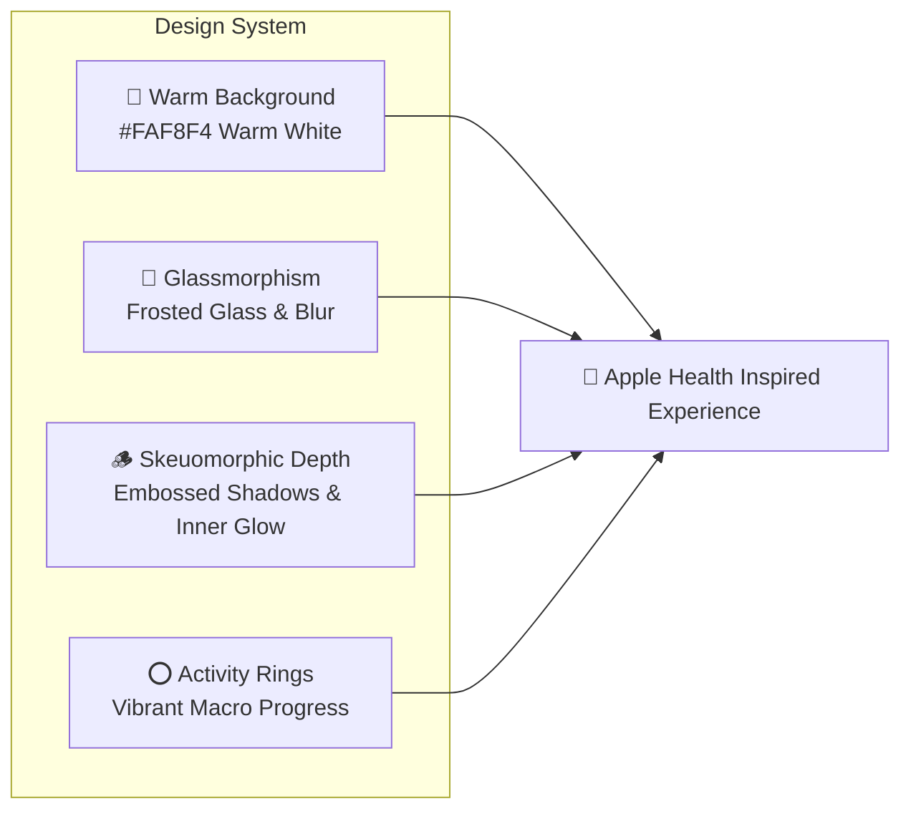
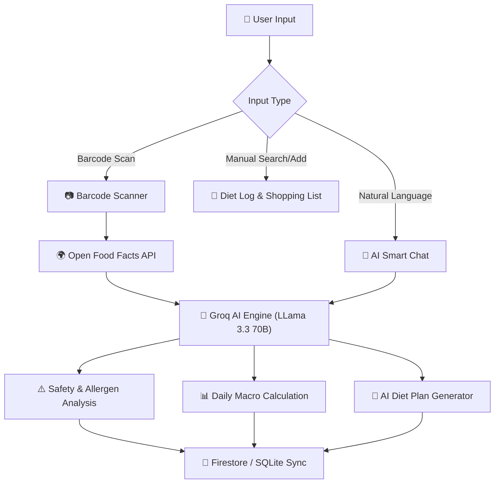

# 🥗 NutriScan AI - Food Insight Scanner
> **Product Requirements & Specification Document**

---

## 📌 Executive Summary

**NutriScan AI - Food Insight Scanner** is a modern, cross-platform mobile application designed to empower individuals to make healthier, safer, and data-driven food choices. Combining real-time barcode scanning, deep AI ingredient analysis, conversational natural language meal logging, personalized next-day diet planning, and offline-capable data synchronization, NutriScan AI transforms nutritional ambiguity into actionable personal health intelligence.

---

## 🎯 Target Users & User Personas

NutriScan AI caters to diverse user demographics with distinct nutritional, health, and dietary monitoring needs:

| User Persona | Key Needs & Pain Points | Primary Features Used |
| :--- | :--- | :--- |
| **Health-Conscious Individuals** | Wants transparency on processed ingredients, hidden sugars, additives, and synthetic preservatives. | Barcode Scanner, Product Safety Analysis, AI Smart Chat |
| **Allergy & Restriction Sufferers** | Needs strict ingredient safety guarantees (e.g., Gluten, Lactose, Nuts, Halal, Vegan, Paleo). | User Profile & Health Goals, Allergen Flagging, Scan History |
| **Fitness Enthusiasts & Athletes** | Tracks daily macronutrients (Proteins, Carbs, Fats) and calorie targets for muscle building or fat loss. | Diet Log & Tracking, Natural Language Auto-Logging, fl_chart Analytics |
| **Curious Shoppers & Families** | Desires quick grocery validation and curated healthy shopping lists while navigating food stores. | Barcode Scanner, Shopping List Manager, Healthy Alternatives |

---

## 🎨 Design Philosophy & Visual Identity

NutriScan AI bridges physical tactile feedback with modern digital transparency, heavily inspired by the premium visual aesthetics of **Apple Health**.

### Core Design Principles
1. **Warm White Palette (`#FAF8F4`)**: Soft, organic background tones eliminate harsh dark/light contrast, delivering a warm, approachable culinary atmosphere.
2. **Glassmorphic Transparency**: Frosted glass bottom navigation bars, backdrop blur filters, and floating translucent header cards ensure spatial context and layering depth.
3. **Skeuomorphic Depth**: Tactile visual feedback utilizing dual-shadow embossing, subtle inner glows, and rounded container bevels that mimic physical health cards.
4. **Vibrant Health Rings & Indicators**: High-contrast, color-coded health badges (Green = Safe, Yellow = Caution, Red = Hazard) alongside vibrant circular macro rings powered by `fl_chart`.

---

## 🚀 Core Features Deep-Dive

---

### 1. 📷 Smart Barcode Scanner
* **Description**: Real-time camera scanning interface leveraging high-precision barcode detection.
* **Functionality**:
  * Scans standard food product barcodes (UPC-A, EAN-13, EAN-8).
  * Automatically fetches product metadata from the **Open Food Facts API**.
  * Evaluates product ingredients against the user's specific allergy list and health goals.
  * Provides tactile haptic feedback and reticle visual overlays upon barcode capture.
  * Includes flash toggle and manual barcode input fallback for damaged or unreadable labels.

---

### 2. 🤖 AI Smart Chat & Natural Language Logger
* **Description**: Interactive conversational assistant powered by **Groq AI (LLama 3.3 70B)** with contextual memory of user health profile data.
* **Functionality**:
  * **Natural Language Meal Auto-Logging**: Parses casual user inputs such as *"I had 2 dosas and a cup of chai for breakfast"* and automatically converts them into structured meal entries with estimated calories, protein, carbs, and fat.
  * Context-aware conversational guidance on nutritional queries, recipe swaps, and dietary advice.
  * Fast response streaming utilizing Groq's high-throughput LLM infrastructure.

---

### 3. 📓 Diet Log & Macro Tracking
* **Description**: Interactive daily nutrition diary tracking calories and macronutrient ratios.
* **Functionality**:
  * Visual macronutrient distribution (Protein, Carbohydrates, Fats, Fiber, Sugar, Sodium) visualized with `fl_chart` rings and progress bars.
  * Date-based navigation allowing users to review historical consumption or plan future entries.
  * Seamless integration with both AI natural language auto-logging and manual item entry fallbacks.

---

### 4. 📅 AI Diet Plan Generator
* **Description**: Proactive nutritional planning agent that analyzes daily intake gaps and recommends tailored menus.
* **Functionality**:
  * Evaluates current day calorie and macro deficits against target health goals (e.g., Muscle Gain, Weight Loss).
  * Generates personalized, balanced meal proposals for the next day.
  * Provides itemized ingredient lists with direct export functionality to the user's Shopping List.

---

### 5. ⚠️ Product Safety & Allergen Analysis
* **Description**: Deep AI-powered safety audit engine for processed foods.
* **Functionality**:
  * Flags registered allergens (e.g., Gluten, Dairy, Peanuts, Soy, Shellfish) based on the user's onboarding profile.
  * Categorizes harmful additives, artificial preservatives, ultra-processed markers, and excess sodium/sugar levels.
  * Computes an intuitive, color-coded Safety Score (0–100) with detailed plain-language risk breakdowns.

---

### 6. 📜 Scan History
* **Description**: Chronological feed of previously scanned products for quick offline reference.
* **Functionality**:
  * Displays scanned items with thumbnail images, brand names, safety badges, and date stamps.
  * Local caching via SQLite (`sqflite`) for instant offline lookup without network requests.
  * Filterable by safety status (Safe, Caution, Avoid).

---

### 7. 👤 User Profile & Health Goals Onboarding
* **Description**: Personalized health setting engine establishing user baseline metrics.
* **Functionality**:
  * Multi-step onboarding collecting biometric metrics (Age, Weight, Height, Gender, Activity Level).
  * Selectable health goals (Weight Loss, Maintenance, Muscle Building, Heart Health, Diabetes Management).
  * Comprehensive allergy and dietary preference setup (Keto, Vegan, Vegetarian, Halal, Low-FODMAP, Gluten-Free).

---

### 8. 🛒 Shopping List Manager
* **Description**: Dedicated grocery management system integrated into the dietary workflow.
* **Functionality**:
  * Add items directly from scanned food recommendations, AI diet plans, or manual text entries.
  * Check off acquired items while shopping.
  * Category-based organization and persistent storage across user sessions.

---

## 🛠️ Tech Stack & Architecture Summary

| Layer | Component / Library | Purpose & Rationale |
| :--- | :--- | :--- |
| **Frontend Framework** | **Flutter 3.x (Dart)** | Cross-platform high-performance UI rendering for iOS and Android. |
| **State Management** | **Provider** | Lightweight, predictable reactive state propagation across screens. |
| **UI & Animations** | **Sizer**, **flutter_animate**, **fl_chart** | Responsive sizing, smooth micro-interactions, and beautiful health progress charts. |
| **Backend & Cloud Services**| **Firebase Cloud Functions (TypeScript/Node.js)** | Secure API gateway, serverless AI orchestration, and database operations. |
| **AI Inference Engine** | **Groq AI API (LLama 3.3 70B)** | Lightning-fast LLM inference for safety analysis, chat, and meal parsing. |
| **Remote Database** | **Cloud Firestore** | Real-time, cloud-synced document database for user profiles and cloud scan logs. |
| **Local Database** | **SQLite (`sqflite`)** | Fast, reliable local offline storage for scan history and shopping lists. |
| **Authentication** | **Firebase Auth** | Multi-provider authentication supporting Google Sign-In, Email/Password, and Guest access. |
| **External APIs** | **Open Food Facts API** | Comprehensive, crowd-sourced world product barcode database. |

---

## 🔒 Security, Privacy & Data Storage

> [!IMPORTANT]
> User health and dietary information is classified as sensitive data. NutriScan AI enforces strict security isolation across remote and local storage tiers.

1. **Firebase Security Rules**: User profile documents and personal scan logs in Cloud Firestore are restricted strictly to the authenticated `uid` owner.
2. **Anonymous / Guest Mode**: Users can test full app capabilities locally without creating a permanent identity. Accounts can be upgraded seamlessly to Google Sign-In.
3. **Local Encryption & Caching**: SQLite caches sensitive historical data locally, minimizing unnecessary network exposure.
4. **API Key Security**: All Groq AI API keys and external credentials are strictly sequestered within Firebase Cloud Functions environment secrets.

---

## 🔮 Future Enhancements & Expansion Roadmap

> [!TIP]
> Planned future updates aimed at expanding ecosystem integration and user convenience.

* **Wearable Health Sync**: Integration with Apple HealthKit and Google Health Connect for dynamic calorie expenditure sync.
* **Multi-Barcode Batch Scanning**: Continuous camera scanning mode for rapid grocery cart auditing.
* **OCR Label Reader**: Optical Character Recognition for unpackaged or non-barcoded food packaging ingredient labels.
* **Community Product Corrections**: User-driven corrections and photo submissions for unlisted local items.
