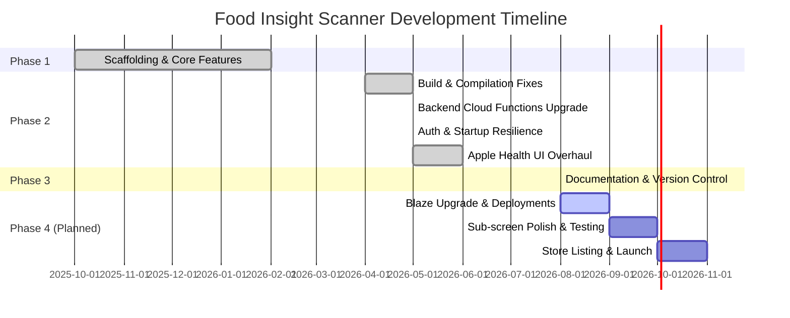
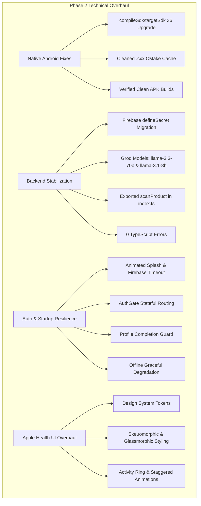
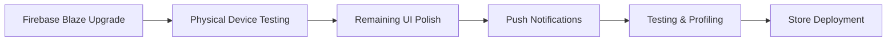

# Food Insight Scanner — Project Progress & Roadmap

> **Current Project Status:** Active Development / Phase 3 (Documentation & Release Prep)  
> **Last Updated:** August 2026  
> **Target Platforms:** Android, iOS  
> **Tech Stack:** Flutter, Firebase (Auth, Firestore, Cloud Functions), Groq AI API, Open Food Facts  

---

## Executive Summary & Status Overview

Food Insight Scanner is a mobile application built with Flutter and Firebase that provides instant, AI-driven dietary insights from product barcode scans and meal logs. Development has progressed through foundational scaffolding, major build and compilation stabilization, a full cloud function backend upgrade, and an Apple Health-inspired dark-mode UI redesign.



### Development Completion Matrix

| Phase | Milestone | Status | Target Completion |
| :--- | :--- | :---: | :--- |
| **Phase 1** | Scaffolding, Core Scanner, Backend & AI MVP | `100% Completed` | Q1 2026 |
| **Phase 2** | Build Fixes, Backend Secrets, AuthGate & UI Redesign | `100% Completed` | May 2026 |
| **Phase 3** | Documentation, Codebase Architecture & Git Sync | `100% Completed` | August 2026 |
| **Phase 4** | Firebase Deployment, Testing, Push Reminders & Launch | `Planned` | Q3–Q4 2026 |

---

## Project Timeline & Detailed Milestones

### Phase 1: Initial Development (Completed)

The foundational phase established the Flutter app architecture, authentication pipelines, hardware scanner integration, third-party database connections, and AI integrations.

* **Scaffolding & Firebase Setup:** Created project base with Firebase SDK integration for Authentication, Cloud Firestore, and Cloud Functions.
* **Barcode Scanner Integration:** Implemented real-time barcode camera scanning utilizing the `mobile_scanner` plugin.
* **Open Food Facts API:** Integrated product lookup querying Open Food Facts REST APIs with local fallback handling for unmapped barcodes.
* **Authentication Layer:** Implemented multi-provider authentication supporting Google Sign-In, Email/Password, and Guest Mode.
* **Firestore Data Models:** Developed data services and schemas for user profiles, scan history logs, dietary restrictions, and daily meal records.
* **AI Engine & Cloud Functions:** Connected Firebase Cloud Functions to the Groq API for dietary advice generation, ingredient risk analysis, and meal parsing.
* **Diet Log & Meal Parser:** Built natural language meal entry parser powered by LLM processing to automatically log calories and macros.
* **Product Details Screen:** Designed initial product analysis view showing Nutri-Score, Eco-Score, ingredient breakdowns, and allergen flags.
* **Profile Setup Wizard:** Implemented multi-step onboarding wizard collecting user dietary goals, allergies, and health conditions.
* **Core Navigation:** Created basic bottom-nav routing and screen state managers.

---

### Phase 2: Major Debug & UI Overhaul (Completed — May 2026)

Phase 2 addressed critical native build errors, updated outdated AI models, secured secret keys, overhauled startup routing, and delivered a top-tier Apple Health-inspired visual overhaul.



#### Build & Compilation Fixes
- [x] **SDK Upgrade:** Upgraded `compileSdk` and `targetSdk` to **36** to resolve `fluttertoast` and native dependency compatibility conflicts.
- [x] **Native Build Cache Cleanup:** Resolved native C++ compilation failure (`MalformedJsonException`) caused by corrupted CMake `.cxx` build artifacts by restructuring Gradle configuration and purging cache directories.
- [x] **Gradle Build Cleaning:** Standardized and cleaned Gradle configurations across app module and plugin modules.
- [x] **APK Build Verification:** Verified 100% clean output for both debug (`flutter run`) and production release APK builds (`flutter build apk --release`).

#### Backend Cloud Functions Fixes
- [x] **Firebase Secrets Migration:** Migrated all 7 Cloud Functions to use Firebase `defineSecret` for managing `GROQ_API_KEY`, eliminating plaintext key risks and legacy `functions.config()` dependencies.
- [x] **Groq AI Model Update:** Updated outdated Groq model endpoints to modern production endpoints: `llama-3.3-70b-versatile` (deep food analysis & chat) and `llama-3.1-8b-instant` (fast meal parsing).
- [x] **Cloud Function Export:** Fixed missing export for `scanProduct` in `functions/src/index.ts`.
- [x] **TypeScript Verification:** Resolved all backend TypeScript compilation issues resulting in 0 compiler errors (`npm run build`).

#### Authentication & Startup Resilience
- [x] **Splash Screen Overhaul:** Rewrote splash screen with infinite animated branding pulse, automatic connection health checks, and Firebase initialization timeout handling.
- [x] **AuthGate Architecture:** Implemented a robust `AuthGate` widget ensuring explicit state machine transitions between unauthenticated, logged in, and onboarding states.
- [x] **Profile Verification Guard:** Added strict profile completion checking preventing incomplete user setups from entering the main dashboard.
- [x] **Offline Resilience:** Added graceful degradation support allowing the app to launch and function seamlessly during offline or Firebase-unavailable scenarios.

#### Premium UI/UX Overhaul (Apple Health Inspired)
- [x] **Design System Tokens:** Created full design system under `lib/theme/` comprising:
  - `FoodInsightColors`: Deep midnight canvas (`#0A0E1A`), frosted obsidian surfaces, vibrant emerald (`#10B981`) and coral highlights.
  - `FoodInsightTypography`: Clean typography scale hierarchy.
  - `FoodInsightShadows`: Multi-layered bloom lighting and depth shadows.
  - `FoodInsightRadius`: Consistent rounded corner tokens.
  - `FoodInsightAnimations`: Smooth curve and duration presets.
- [x] **Glassmorphic Login & Auth:** Redesigned login and signup screens with skeuomorphic tactile inputs and glassmorphic card overlays.
- [x] **Greeting Header:** Upgraded dashboard header featuring an animated user avatar, dynamic time-based greeting, and notification bell widget.
- [x] **Gradient Activity Ring:** Built a dual-ring progress card (`NutritionSummaryCard`) displaying calorie and macro tracking with smooth sweep gradient animations.
- [x] **Quick Actions Grid:** Redesigned `QuickActionsSection` with tactile micro-press animations, gradient icons, and quick-launch shortcuts.
- [x] **Recent Scans Section:** Upgraded scan history previews with staggered entry animations and vibrant Nutri-Score indicator chips.
- [x] **Diet Log Preview:** Enhanced daily meal logging UI with premium card entries and macro breakdown badges.
- [x] **Frosted Glass Navigation:** Built a custom floating bottom navigation bar with real-time background blur filter (`BackdropFilter`).
- [x] **Floating 'Scan Now' FAB:** Designed floating action button featuring an ambient emerald glow shadow and press animation.

---

### Phase 3: Documentation & Version Control (Current — August 2026)

This phase ensures full maintainability, enterprise-grade architecture documentation, and clean version control tracking.

- [x] **Git Repository Cleanup:** Performed comprehensive `.gitignore` updates excluding native cache artifacts (`.cxx/`, `.gradle/`, `build/`), environment secrets, and IDE configs.
- [x] **Comprehensive Documentation Suite:**
  - `PRODUCT.md`: High-level vision, feature specifications, target personas, and market positioning.
  - `ARCHITECTURE.md`: Complete system architecture, data models, cloud infrastructure, and security rules.
  - `CONTEXT.md`: High-density reference document summarizing key design decisions, API contracts, and environment setup.
  - `PROGRESS.md`: Detailed milestone progress tracking, completed features, and future roadmap.
  - `BUGS.md`: Bug tracking register detailing resolved technical debt and outstanding operational items.
- [x] **Git Version Control Sync:** Organized clean commits and pushed complete repository updates to GitHub remote repository.

---

## What's Next (Planned Roadmap)

The upcoming development lifecycle focuses on infrastructure upgrades, hardware verification, remaining UI polish, automated test coverage, and app store publishing.



### Target Tasks & Upcoming Deliverables

- [x] **Migrate off Cloud Functions:** Removed Firebase Cloud Functions dependency and migrated to direct HTTP calls to Groq API and Open Food Facts to bypass Firebase Blaze pay-as-you-go restriction.
- [x] **Fix bugs:** Resolved 17 bugs across the app including offline persistence, AI JSON parsing logic, and Google Auth routing issues.
- [x] **AI Stabilisation:** Integrated a highly robust `_extractJson` parser to flawlessly extract strict JSON from LLM outputs, preventing crashes on product AI analysis and smart meal plan generation.
- [x] **Profile Picture Integration:** Successfully integrated direct Google Account photoURL and email loading onto the Dashboard and Profile UI components.
- [ ] **Google Sign-In SHA Fingerprint Verification:** Register debug and release SHA-1/SHA-256 fingerprints in Firebase Console for production Android devices.
- [ ] **Sub-Screen UI Polish:** Apply the Apple Health glassmorphic design system to remaining sub-screens:
  - Scan History full listing screen
  - Settings & Preferences panel
  - Shopping List manager
  - AI Assistant Chat detail view
- [ ] **Push Notifications:** Configure Firebase Cloud Messaging (FCM) for personalized daily diet logging reminders and weekly nutrition digests.
- [ ] **Unit & Widget Testing:** Implement automated unit testing for services/models and widget integration tests for critical flows (Scanner, AuthGate, Diet Log).
- [ ] **Performance Profiling & Optimization:** Run Flutter DevTools performance audits to optimize frame rendering, reduce image memory footprints, and verify low-end device smoothness.
- [ ] **App Store & Play Store Publishing:** Prepare store collateral, privacy policy documentation, app icons, splash screens, and release bundles (`.aab` / `.ipa`).

---

## Technical Summary & Metrics

```
+-------------------------------------------------------------------+
|                     FOOD INSIGHT SCANNER METRICS                  |
+-------------------------------------------------------------------+
|  Flutter SDK Version    : >=3.2.0 <4.0.0                          |
|  Android compileSdk     : 36                                      |
|  Android targetSdk      : 36                                      |
|  Cloud Functions        : 7 TypeScript Functions                  |
|  AI Models              : llama-3.3-70b-versatile                 |
|                           llama-3.1-8b-instant                    |
|  TypeScript Compiler    : 0 Errors                                |
|  Design Theme           : Midnight Glassmorphism (Dark Mode)      |
+-------------------------------------------------------------------+
```

---

*This document is maintained as part of the official project documentation suite. For architectural details, consult [ARCHITECTURE.md](file:///d:/Downloads/food_insight_scanner/food_insight_scanner/docs/ARCHITECTURE.md). For product features, consult [PRODUCT.md](file:///d:/Downloads/food_insight_scanner/food_insight_scanner/docs/PRODUCT.md).*
